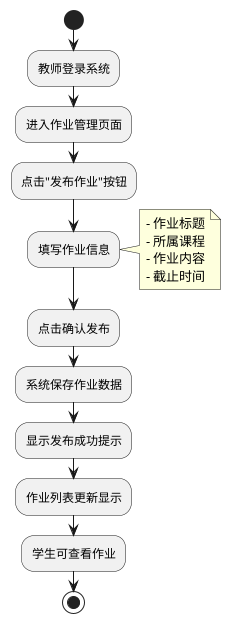
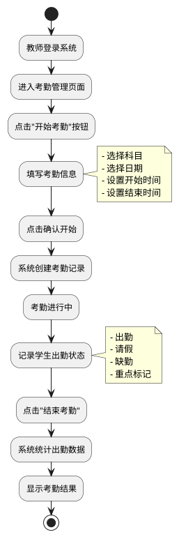
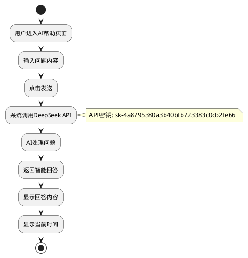
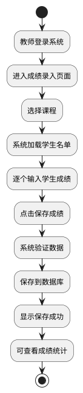
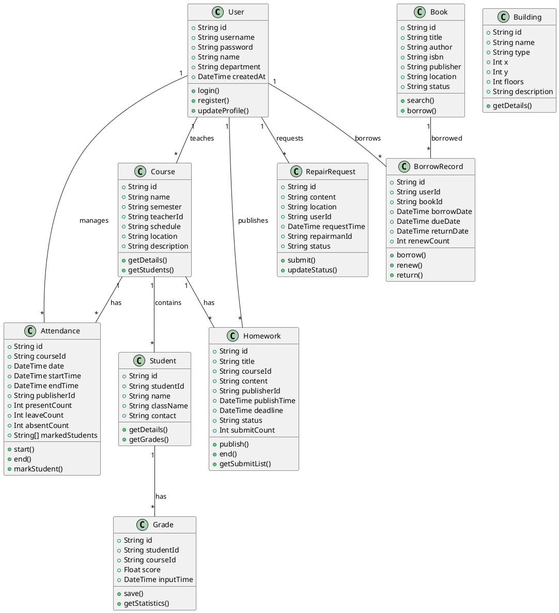

# 教师智慧校园系统项目文档

---

## 1 项目计划

### 1.1 项目简介

**项目名称**：教师智慧校园系统

**所属行业**：教育信息化 / 智慧校园

**主要功能与内容**：

教师智慧校园系统是一款面向大学教师的综合管理平台，旨在帮助教师高效管理教学事务、学生信息、作业考勤等日常工作。系统集成DeepSeek AI智能助手，提供智能问答、作业生成、自动批改等智能化功能。

**核心功能模块**：
- AI帮助中心：智能问答服务
- 教务管理：授课管理、课程表、成绩录入与统计
- 作业管理：发布、结束、提交情况查看
- 考勤管理：开始/结束考勤、出勤统计、重点人员标记
- 期中测试题库：AI出题、自主出题、AI批改
- 学生管理：学生名单、详情查看
- 校园服务：校园地图、食堂、图书借阅、报修通道
- 作业练习：AI生成作业、AI批改

---

### 1.2 项目背景

#### 1.2.1 政策支持

**《教育强国建设规划纲要（2024—2035年）》**

中共中央、国务院印发《教育强国建设规划纲要（2024—2035年）》，面向到2035年建成教育强国目标，对加快建设教育强国作出全面系统部署。明确了以教育数字化开辟发展新赛道、塑造发展新优势等重点任务。

> 来源：[教育部官网](https://www.moe.gov.cn/srcsite/A01/s7048/202504/t20250416_1187476.html)

**《教育部等九部门关于加快推进教育数字化的意见》（教办〔2025〕3号）**

2025年4月，教育部等九部门联合印发文件，明确提出：
- 以教育数字化为重要突破口，开辟教育发展新赛道
- 促进人工智能助力教育变革
- 通过智能学伴、数字导师等探索人机协同教学新模式
- 实现人工智能驱动的大规模因材施教

> 来源：[中国政府网](https://www.gov.cn/zhengce/zhengceku/202504/content_7019045.htm)

**2025年全国教育工作会议**

会议指出，要持续推进国家教育数字化战略，助力教育教学深层次变革。强化制度建设，全面提升数字化领导力，始终坚持"应用为王"，加强前瞻布局。

> 来源：[教育部科技与信息化司](http://www.moe.gov.cn/s78/A16/gongzuo/gzzl_yb/202502/t20250228_1180690.html)

#### 1.2.2 行业现状

**高校数字化转型快速发展**

根据《2024中国高校数字化发展报告》显示：
- 68.7%的高校开展了一定程度的人工智能应用
- 教学活动和实习实训是AI应用最聚焦的领域
- 90.7%的高校开展信息化教学能力培训
- 75.2%的高校采用教学质量评估督促教师利用信息化开展教学

> 来源：[中国教育网络](https://www.edu.cn/xxh/xy/xytp/202605/t20260514_2734706.shtml)

**教师管理面临新挑战**

当前高校教师管理存在以下问题：
- 评估机制僵化，激励反馈机制缺失
- 传统管理模式难以适应高质量发展需求
- 信息技术深度介入教育生态，数字化转型成为必然趋势
- 数据共享不畅、系统整合不足、信息应用孤岛

> 来源：[广东省高等教育学会](https://www.gdgjxh.org.cn/details/3558.html)

#### 1.2.3 经济背景

教育信息化市场规模持续增长，智慧校园建设投入逐年增加。高校数字化转型已成为提升教育质量、促进教育公平的重要手段，具有广阔的市场前景和社会价值。

---

### 1.3 功能需求分析

#### 1.3.1 痛点问题/核心业务

**痛点问题**：

1. **教学管理效率低下**
   - 传统纸质记录方式效率低、易出错
   - 作业发布、收集、批改流程繁琐
   - 考勤记录统计耗时费力

2. **信息孤岛问题严重**
   - 各系统数据不互通
   - 教师需要在多个平台切换操作
   - 数据重复录入，浪费时间

3. **智能化程度不足**
   - 缺乏AI辅助教学工具
   - 作业批改依赖人工，效率低
   - 无法实现个性化教学指导

4. **校园服务分散**
   - 图书借阅、报修等服务分散在不同平台
   - 缺乏统一的校园信息入口
   - 教师获取信息不便

**核心业务逻辑**：

| 业务模块 | 核心功能 | 业务流程 |
|---------|---------|---------|
| 教务管理 | 授课管理、成绩录入 | 选择学期→查看课程→录入成绩→保存统计 |
| 作业管理 | 发布、查看、结束 | 填写作业信息→发布→查看提交情况→结束 |
| 考勤管理 | 开始、统计、结束 | 选择科目时间→开始考勤→记录出勤→结束统计 |
| AI服务 | 智能问答、AI批改 | 输入问题→AI回答→查看结果 |

#### 1.3.2 产品结构图

```
教师智慧校园系统
│
├── AI帮助中心
│   └── 智能问答服务
│
├── 个人中心
│   ├── 用户信息管理
│   └── 账号设置
│
├── 教务管理
│   ├── 我的授课
│   │   ├── 学期选择
│   │   └── 课程详情
│   ├── 课程表
│   │   ├── 学期筛选
│   │   └── 课程信息
│   ├── 成绩录入
│   │   ├── 课程选择
│   │   └── 成绩保存
│   └── 成绩统计
│   │   ├── 学科分析
│   │   └── 分数段统计
│
├── 作业管理
│   ├── 发布作业
│   ├── 查看提交情况
│   ├── 结束作业
│   └── 筛选（全部/我的发布）
│
├── 考勤管理
│   ├── 开始考勤
│   ├── 出勤统计
│   ├── 结束考勤
│   ├── 重点人员标记
│   └── 筛选（全部/我的发布）
│
├── 期中测试题库
│   ├── AI出题
│   ├── 自主出题
│   └── AI批改
│
├── 学生管理
│   ├── 学生名单
│   ├── 学生详情
│   └── 人数统计
│
├── 校园服务
│   ├── 校园地图
│   │   ├── 建筑物展示
│   │   ├── 详情查看
│   │   └── 类型筛选
│   ├── 食堂
│   │   ├── 菜品查看
│   │   ├── 价格信息
│   │   └── 食堂切换
│   ├── 图书借阅
│   │   ├── 图书检索
│   │   ├── 我的借阅
│   │   ├── 续借归还
│   │   └── 借阅历史
│   └── 报修通道
│   │   ├── 提交报修
│   │   └── 修理员信息
│
├── 作业练习
│   ├── AI生成作业
│   └── AI批改
│
└── 消息通知
    ├── 系统通知
    ├── 学术通知
    └── 个人消息
```

#### 1.3.3 主要业务流程描述

**1. 作业发布流程**



**2. 考勤管理流程**



**3. AI智能问答流程**



**4. 成绩录入流程**



#### 1.3.4 信息结构图

```
数据信息结构
│
├── 用户信息
│   ├── 用户ID
│   ├── 用户名
│   ├── 密码
│   ├── 姓名
│   ├── 部门
│   └── 创建时间
│
├── 课程信息
│   ├── 课程ID
│   ├── 课程名称
│   ├── 学期
│   ├── 授课教师
│   ├── 上课时间
│   ├── 上课地点
│   └── 课程描述
│
├── 作业信息
│   ├── 作业ID
│   ├── 作业标题
│   ├── 所属课程
│   ├── 作业内容
│   ├── 发布人
│   ├── 发布时间
│   ├── 截止时间
│   ├── 状态（进行中/已结束）
│   └── 提交人数
│
├── 考勤信息
│   ├── 考勤ID
│   ├── 科目
│   ├── 考勤日期
│   ├── 开始时间
│   ├── 结束时间
│   ├── 发布人
│   ├── 出勤人数
│   ├── 请假人数
│   ├── 缺勤人数
│   └── 重点人员列表
│
├── 学生信息
│   ├── 学生ID
│   ├── 学号
│   ├── 姓名
│   ├── 班级
│   └── 联系方式
│
├── 成绩信息
│   ├── 成绩ID
│   ├── 学生ID
│   ├── 课程ID
│   ├── 成绩分数
│   └── 录入时间
│
├── 图书信息
│   ├── 图书ID
│   ├── 书名
│   ├── 作者
│   ├── ISBN
│   ├── 出版社
│   ├── 馆藏位置
│   └── 状态（可借/已借）
│
├── 借阅记录
│   ├── 记录ID
│   ├── 用户ID
│   ├── 图书ID
│   ├── 借阅日期
│   ├── 应还日期
│   ├── 归还日期
│   └── 续借次数
│
├── 报修信息
│   ├── 报修ID
│   ├── 报修内容
│   ├── 报修位置
│   ├── 报修人
│   ├── 报修时间
│   ├── 修理员信息
│   └── 状态（待处理/处理中/已完成）
│
├── 食堂菜单
│   ├── 菜品ID
│   ├── 菜品名称
│   ├── 价格
│   ├── 分类
│   ├── 售出数量
│   └── 所属食堂
│
└── 建筑物信息
    ├── 建筑ID
    ├── 名称
    ├── 类型
    ├── 位置坐标
    ├── 楼层数
    └── 描述
```

---

## 2 前端设计与开发

### 2.1 模块架构设计

#### 2.1.1 模块命名与结构

```
前端模块结构
│
├── 核心模块
│   ├── app-main          # 主应用容器
│   ├── sidebar           # 侧边栏导航
│   ├── header            # 顶部导航栏
│   └── content           # 内容区域
│
├── 页面模块
│   ├── page-home         # 首页
│   ├── page-ai-help      # AI帮助
│   ├── page-profile      # 个人中心
│   ├── page-teaching     # 我的授课
│   ├── page-schedule     # 课程表
│   ├── page-grade-input  # 成绩录入
│   ├── page-grade-stat   # 成绩统计
│   ├── page-homework     # 作业管理
│   ├── page-attendance   # 考勤管理
│   ├── page-test-bank    # 期中测试题库
│   ├── page-students     # 学生名单
│   ├── page-campus-map   # 校园地图
│   ├── page-canteen      # 食堂
│   ├── page-library      # 图书借阅
│   ├── page-repair       # 报修通道
│   ├── page-practice     # 作业练习
│   └── page-notice       # 消息通知
│
├── 组件模块
│   ├── modal             # 模态框组件
│   ├── toast             # 提示消息组件
│   ├── table             # 表格组件
│   ├── form              # 表单组件
│   ├── card              # 卡片组件
│   └── button            # 按钮组件
│
└── 服务模块
    ├── api-service       # API调用服务
    ├── auth-service      # 认证服务
    ├── storage-service   # 本地存储服务
    └── ai-service        # AI服务
```

#### 2.1.2 页面命名与结构

| 页面名称 | 文件位置 | 功能描述 |
|---------|---------|---------|
| 首页 | index.html#home | 欢迎信息、快捷入口 |
| AI帮助 | index.html#ai-help | 智能问答 |
| 个人中心 | index.html#profile | 用户信息管理 |
| 我的授课 | index.html#teaching | 授课管理 |
| 课程表 | index.html#schedule | 课程安排 |
| 成绩录入 | index.html#grade-input | 成绩录入 |
| 成绩统计 | index.html#grade-stat | 成绩分析 |
| 作业管理 | index.html#homework | 作业发布管理 |
| 考勤管理 | index.html#attendance | 考勤记录 |
| 期中测试题库 | index.html#test-bank | AI出题批改 |
| 学生名单 | index.html#students | 学生信息 |
| 校园地图 | index.html#campus-map | 地图展示 |
| 食堂 | index.html#canteen | 菜品信息 |
| 图书借阅 | index.html#library | 借阅管理 |
| 报修通道 | index.html#repair | 报修服务 |
| 作业练习 | index.html#practice | AI作业练习 |
| 消息通知 | index.html#notice | 通知消息 |

### 2.2 核心构造块设计

#### 2.2.1 页面：首页

**1) HTML页面模板DOM结构**

```
首页 (page-home)
│
├── 欢迎区域
│   ├── 用户头像
│   ├── 欢迎文字
│   └── 当前日期
│
├── 统计卡片区域
│   ├── 未读消息卡片
│   ├── 进行中活动卡片
│   └── 新通知卡片
│
└── 快捷入口区域
    ├── 教务管理入口
    ├── 作业管理入口
    ├── 考勤管理入口
    └── 校园服务入口
```

**2) CSS样式与特殊效果**

- 使用Bootstrap卡片组件展示统计信息
- 渐变背景色增强视觉效果
- 响应式布局适配不同屏幕

**3) JS函数逻辑**

| 函数名 | 功能描述 |
|-------|---------|
| `loadHomePage()` | 加载首页数据 |
| `updateStatistics()` | 更新统计卡片数据 |
| `initQuickLinks()` | 初始化快捷入口 |

#### 2.2.2 页面：AI帮助页面

**1) HTML页面模板DOM结构**

```
AI帮助页面 (page-ai-help)
│
├── 页面标题
│   └── "AI帮助"
│
├── 输入区域
│   ├── 问题输入框
│   └── 发送按钮
│
├── 回答展示区域
│   ├── AI头像图标
│   ├── 回答内容框
│   └── 时间戳显示
│
└── 来源信息
    └── "来源：DeepSeek AI"
```

**2) CSS样式与特殊效果**

- AI头像使用渐变圆形背景
- 回答框使用白色背景和阴影效果
- 加载动画使用CSS动画实现

**3) JS函数逻辑**

| 函数名 | 功能描述 |
|-------|---------|
| `aiSearch()` | 调用DeepSeek API获取AI回答 |
| `displayAnswer()` | 显示AI回答内容 |
| `showLoading()` | 显示加载动画 |

**核心代码示例**：

```javascript
async function aiSearch() {
    const question = document.getElementById('aiSearchInput').value.trim();
    if (!question) {
        showToast('请输入问题', 'error');
        return;
    }
    
    const DEEPSEEK_API_KEY = 'sk-4a8795380a3b40bfb723383c0cb2fe66';
    const DEEPSEEK_API_URL = 'https://api.deepseek.com/v1/chat/completions';
    
    const response = await fetch(DEEPSEEK_API_URL, {
        method: 'POST',
        headers: {
            'Content-Type': 'application/json',
            'Authorization': `Bearer ${DEEPSEEK_API_KEY}`
        },
        body: JSON.stringify({
            model: 'deepseek-chat',
            messages: [
                { role: 'system', content: '你是一个智慧校园AI助手...' },
                { role: 'user', content: question }
            ],
            temperature: 0.7,
            max_tokens: 2000
        })
    });
    
    const data = await response.json();
    const aiAnswer = data.choices[0].message.content;
    displayAnswer(aiAnswer);
}
```

#### 2.2.3 页面：作业管理页面

**1) HTML页面模板DOM结构**

```
作业管理页面 (page-homework)
│
├── 页面标题区域
│   ├── 标题文字
│   └── 发布作业按钮
│
├── 筛选区域
│   ├── 全部作业按钮
│   └── 我的发布按钮
│
├── 作业列表区域
│   ├── 表格头部
│   │   ├── 作业标题
│   │   ├── 所属课程
│   │   ├── 发布人
│   │   ├── 发布时间
│   │   ├── 截止时间
│   │   ├── 提交情况
│   │   └── 状态
│   └── 表格内容行
│
└── 发布作业模态框
    ├── 作业标题输入
    ├── 课程选择
    ├── 内容输入
    ├── 截止时间选择
    └── 确认发布按钮
```

**2) CSS样式与特殊效果**

- 表格使用Bootstrap表格样式
- 状态标签使用不同颜色区分
- 模态框使用半透明背景遮罩

**3) JS函数逻辑**

| 函数名 | 功能描述 |
|-------|---------|
| `loadHomeworkList()` | 加载作业列表数据 |
| `publishHomework()` | 发布新作业 |
| `endHomework()` | 结束作业 |
| `filterHomework()` | 筛选作业（全部/我的发布） |
| `showPublishModal()` | 显示发布模态框 |

#### 2.2.4 页面：考勤管理页面

**1) HTML页面模板DOM结构**

```
考勤管理页面 (page-attendance)
│
├── 页面标题区域
│   ├── 标题文字
│   └── 开始考勤按钮
│
├── 筛选区域
│   ├── 科目选择下拉框
│   ├── 日期选择框
│   ├── 全部考勤按钮
│   └── 我的发布按钮
│
├── 统计卡片区域
│   ├── 出勤率卡片
│   ├── 出勤人数卡片
│   ├── 请假人数卡片
│   └── 缺勤人数卡片
│
├── 学生考勤列表
│   ├── 学生姓名
│   ├── 学号
│   ├── 状态选择
│   └── 重点标记
│
├── 考勤记录列表
│   ├── 课程名称
│   ├── 考勤日期
│   ├── 时间段
│   ├── 出勤统计
│   ├── 发布人
│   └── 状态
│
└── 开始考勤模态框
    ├── 科目选择
    ├── 日期选择
    ├── 开始时间
    ├── 结束时间
    └── 确认开始按钮
```

**2) CSS样式与特殊效果**

- 统计卡片使用渐变背景色
- 学生列表使用复选框交互
- 重点人员使用红色标记

**3) JS函数逻辑**

| 函数名 | 功能描述 |
|-------|---------|
| `loadAttendanceData()` | 加载考勤数据 |
| `startAttendance()` | 开始考勤 |
| `endAttendance()` | 结束考勤 |
| `markStudent()` | 标记学生状态 |
| `filterAttendance()` | 筛选考勤记录 |
| `showStartModal()` | 显示开始考勤模态框 |

#### 2.2.5 组件：模态框组件

**1) HTML模板DOM结构**

```
模态框组件 (modal)
│
├── 模态框遮罩层
│   └── 半透明背景
│
└── 模态框内容
    ├── 模态框头部
    │   ├── 标题
    │   └── 关闭按钮
    ├── 模态框主体
    │   └── 内容区域
    └── 模态框底部
        └── 操作按钮
```

**2) CSS样式**

```css
.modal-overlay {
    position: fixed;
    top: 0;
    left: 0;
    width: 100%;
    height: 100%;
    background: rgba(0, 0, 0, 0.5);
    display: flex;
    justify-content: center;
    align-items: center;
    z-index: 1000;
}

.modal-content {
    background: white;
    padding: 20px;
    border-radius: 8px;
    max-width: 500px;
    width: 90%;
}
```

**3) JS函数逻辑**

| 函数名 | 功能描述 |
|-------|---------|
| `showModal()` | 显示模态框 |
| `hideModal()` | 隐藏模态框 |
| `confirmModal()` | 确认模态框操作 |

#### 2.2.6 组件：提示消息组件

**1) HTML模板DOM结构**

```
提示消息组件 (toast)
│
└── 消息容器
    ├── 图标
    ├── 消息文字
    └── 关闭按钮
```

**2) CSS样式**

```css
.toast {
    position: fixed;
    top: 20px;
    right: 20px;
    padding: 12px 20px;
    border-radius: 4px;
    color: white;
    z-index: 9999;
    animation: slideIn 0.3s ease;
}

.toast.success { background: #4CAF50; }
.toast.error { background: #f44336; }
.toast.warning { background: #ff9800; }
```

**3) JS函数逻辑**

| 函数名 | 功能描述 |
|-------|---------|
| `showToast()` | 显示提示消息 |
| `hideToast()` | 隐藏提示消息 |

#### 2.2.7 服务：API服务

**功能描述**：封装所有后端API调用

| 方法名 | 功能描述 |
|-------|---------|
| `fetchData(url)` | 通用数据获取方法 |
| `postData(url, data)` | 通用数据提交方法 |
| `login(username, password)` | 用户登录 |
| `register(userData)` | 用户注册 |
| `getHomeworkList()` | 获取作业列表 |
| `publishHomework(data)` | 发布作业 |
| `getAttendanceList()` | 获取考勤列表 |
| `startAttendance(data)` | 开始考勤 |

#### 2.2.8 服务：认证服务

**功能描述**：管理用户认证状态

| 方法名 | 功能描述 |
|-------|---------|
| `checkAuth()` | 检查用户登录状态 |
| `saveToken(token)` | 保存登录令牌 |
| `getToken()` | 获取登录令牌 |
| `clearToken()` | 清除登录令牌 |
| `getUserInfo()` | 获取用户信息 |

---

## 3 微服务设计与开发

### 3.1 UML类图的设计



### 3.2 关系数据库模式设计

#### (1) 数据表结构

**用户表 (users)**

| 字段名 | 字段类型 | 说明 |
|-------|---------|------|
| id | VARCHAR(36) | 主键，UUID |
| username | VARCHAR(50) | 用户名，唯一 |
| password | VARCHAR(255) | 密码（加密） |
| name | VARCHAR(100) | 姓名 |
| department | VARCHAR(100) | 部门 |
| created_at | DATETIME | 创建时间 |

**课程表 (courses)**

| 字段名 | 字段类型 | 说明 |
|-------|---------|------|
| id | VARCHAR(36) | 主键 |
| name | VARCHAR(100) | 课程名称 |
| semester | VARCHAR(20) | 学期 |
| teacher_id | VARCHAR(36) | 教师ID，外键 |
| schedule | VARCHAR(255) | 上课时间 |
| location | VARCHAR(100) | 上课地点 |
| description | TEXT | 课程描述 |

**作业表 (homeworks)**

| 字段名 | 字段类型 | 说明 |
|-------|---------|------|
| id | VARCHAR(36) | 主键 |
| title | VARCHAR(200) | 作业标题 |
| course_id | VARCHAR(36) | 课程ID，外键 |
| content | TEXT | 作业内容 |
| publisher_id | VARCHAR(36) | 发布人ID，外键 |
| publish_time | DATETIME | 发布时间 |
| deadline | DATETIME | 截止时间 |
| status | VARCHAR(20) | 状态 |
| submit_count | INT | 提交人数 |

**考勤表 (attendances)**

| 字段名 | 字段类型 | 说明 |
|-------|---------|------|
| id | VARCHAR(36) | 主键 |
| course_id | VARCHAR(36) | 课程ID，外键 |
| date | DATE | 考勤日期 |
| start_time | TIME | 开始时间 |
| end_time | TIME | 结束时间 |
| publisher_id | VARCHAR(36) | 发布人ID，外键 |
| present_count | INT | 出勤人数 |
| leave_count | INT | 请假人数 |
| absent_count | INT | 缺勤人数 |
| marked_students | TEXT | 重点人员JSON |

**学生表 (students)**

| 字段名 | 字段类型 | 说明 |
|-------|---------|------|
| id | VARCHAR(36) | 主键 |
| student_id | VARCHAR(20) | 学号，唯一 |
| name | VARCHAR(100) | 姓名 |
| class_name | VARCHAR(50) | 班级 |
| contact | VARCHAR(50) | 联系方式 |

**成绩表 (grades)**

| 字段名 | 字段类型 | 说明 |
|-------|---------|------|
| id | VARCHAR(36) | 主键 |
| student_id | VARCHAR(36) | 学生ID，外键 |
| course_id | VARCHAR(36) | 课程ID，外键 |
| score | FLOAT | 成绩分数 |
| input_time | DATETIME | 录入时间 |

**图书表 (books)**

| 字段名 | 字段类型 | 说明 |
|-------|---------|------|
| id | VARCHAR(36) | 主键 |
| title | VARCHAR(200) | 书名 |
| author | VARCHAR(100) | 作者 |
| isbn | VARCHAR(20) | ISBN号 |
| publisher | VARCHAR(100) | 出版社 |
| location | VARCHAR(50) | 馆藏位置 |
| status | VARCHAR(20) | 状态 |

**借阅记录表 (borrow_records)**

| 字段名 | 字段类型 | 说明 |
|-------|---------|------|
| id | VARCHAR(36) | 主键 |
| user_id | VARCHAR(36) | 用户ID，外键 |
| book_id | VARCHAR(36) | 图书ID，外键 |
| borrow_date | DATE | 借阅日期 |
| due_date | DATE | 应还日期 |
| return_date | DATE | 归还日期 |
| renew_count | INT | 续借次数 |

**报修表 (repairs)**

| 字段名 | 字段类型 | 说明 |
|-------|---------|------|
| id | VARCHAR(36) | 主键 |
| content | TEXT | 报修内容 |
| location | VARCHAR(100) | 报修位置 |
| user_id | VARCHAR(36) | 报修人ID，外键 |
| request_time | DATETIME | 报修时间 |
| repairman_id | VARCHAR(36) | 修理员ID |
| status | VARCHAR(20) | 状态 |

**食堂菜单表 (canteen_menus)**

| 字段名 | 字段类型 | 说明 |
|-------|---------|------|
| id | VARCHAR(36) | 主键 |
| name | VARCHAR(100) | 菜品名称 |
| price | FLOAT | 价格 |
| category | VARCHAR(50) | 分类 |
| sold_count | INT | 售出数量 |
| canteen_id | VARCHAR(36) | 食堂ID |

**建筑物表 (buildings)**

| 字段名 | 字段类型 | 说明 |
|-------|---------|------|
| id | VARCHAR(36) | 主键 |
| name | VARCHAR(100) | 建筑名称 |
| type | VARCHAR(50) | 类型 |
| x | INT | X坐标 |
| y | INT | Y坐标 |
| width | INT | 宽度 |
| height | INT | 高度 |
| floors | INT | 楼层数 |
| description | TEXT | 描述 |

#### (2) SQL建表语句

```sql
-- 创建数据库
CREATE DATABASE campus_qa_platform DEFAULT CHARACTER SET utf8mb4;

-- 用户表
CREATE TABLE users (
    id VARCHAR(36) PRIMARY KEY,
    username VARCHAR(50) UNIQUE NOT NULL,
    password VARCHAR(255) NOT NULL,
    name VARCHAR(100),
    department VARCHAR(100),
    created_at DATETIME DEFAULT CURRENT_TIMESTAMP
);

-- 课程表
CREATE TABLE courses (
    id VARCHAR(36) PRIMARY KEY,
    name VARCHAR(100) NOT NULL,
    semester VARCHAR(20),
    teacher_id VARCHAR(36),
    schedule VARCHAR(255),
    location VARCHAR(100),
    description TEXT,
    FOREIGN KEY (teacher_id) REFERENCES users(id)
);

-- 学生表
CREATE TABLE students (
    id VARCHAR(36) PRIMARY KEY,
    student_id VARCHAR(20) UNIQUE NOT NULL,
    name VARCHAR(100) NOT NULL,
    class_name VARCHAR(50),
    contact VARCHAR(50)
);

-- 作业表
CREATE TABLE homeworks (
    id VARCHAR(36) PRIMARY KEY,
    title VARCHAR(200) NOT NULL,
    course_id VARCHAR(36),
    content TEXT,
    publisher_id VARCHAR(36),
    publish_time DATETIME DEFAULT CURRENT_TIMESTAMP,
    deadline DATETIME,
    status VARCHAR(20) DEFAULT '进行中',
    submit_count INT DEFAULT 0,
    FOREIGN KEY (course_id) REFERENCES courses(id),
    FOREIGN KEY (publisher_id) REFERENCES users(id)
);

-- 考勤表
CREATE TABLE attendances (
    id VARCHAR(36) PRIMARY KEY,
    course_id VARCHAR(36),
    date DATE,
    start_time TIME,
    end_time TIME,
    publisher_id VARCHAR(36),
    present_count INT DEFAULT 0,
    leave_count INT DEFAULT 0,
    absent_count INT DEFAULT 0,
    marked_students TEXT,
    FOREIGN KEY (course_id) REFERENCES courses(id),
    FOREIGN KEY (publisher_id) REFERENCES users(id)
);

-- 成绩表
CREATE TABLE grades (
    id VARCHAR(36) PRIMARY KEY,
    student_id VARCHAR(36),
    course_id VARCHAR(36),
    score FLOAT,
    input_time DATETIME DEFAULT CURRENT_TIMESTAMP,
    FOREIGN KEY (student_id) REFERENCES students(id),
    FOREIGN KEY (course_id) REFERENCES courses(id)
);

-- 图书表
CREATE TABLE books (
    id VARCHAR(36) PRIMARY KEY,
    title VARCHAR(200) NOT NULL,
    author VARCHAR(100),
    isbn VARCHAR(20),
    publisher VARCHAR(100),
    location VARCHAR(50),
    status VARCHAR(20) DEFAULT '可借'
);

-- 借阅记录表
CREATE TABLE borrow_records (
    id VARCHAR(36) PRIMARY KEY,
    user_id VARCHAR(36),
    book_id VARCHAR(36),
    borrow_date DATE,
    due_date DATE,
    return_date DATE,
    renew_count INT DEFAULT 0,
    FOREIGN KEY (user_id) REFERENCES users(id),
    FOREIGN KEY (book_id) REFERENCES books(id)
);

-- 报修表
CREATE TABLE repairs (
    id VARCHAR(36) PRIMARY KEY,
    content TEXT,
    location VARCHAR(100),
    user_id VARCHAR(36),
    request_time DATETIME DEFAULT CURRENT_TIMESTAMP,
    repairman_id VARCHAR(36),
    status VARCHAR(20) DEFAULT '待处理',
    FOREIGN KEY (user_id) REFERENCES users(id)
);

-- 食堂菜单表
CREATE TABLE canteen_menus (
    id VARCHAR(36) PRIMARY KEY,
    name VARCHAR(100) NOT NULL,
    price FLOAT,
    category VARCHAR(50),
    sold_count INT DEFAULT 0,
    canteen_id VARCHAR(36)
);

-- 建筑物表
CREATE TABLE buildings (
    id VARCHAR(36) PRIMARY KEY,
    name VARCHAR(100) NOT NULL,
    type VARCHAR(50),
    x INT,
    y INT,
    width INT,
    height INT,
    floors INT,
    description TEXT
);
```

#### (3) SQL插入语句（模拟数据）

```sql
-- 插入用户数据
INSERT INTO users (id, username, password, name, department) VALUES
('u001', 'teacher1', 'encrypted_password', '张教授', '计算机学院'),
('u002', 'teacher2', 'encrypted_password', '李教授', '数学学院'),
('u003', 'teacher3', 'encrypted_password', '王教授', '物理学院');

-- 插入课程数据
INSERT INTO courses (id, name, semester, teacher_id, schedule, location) VALUES
('c001', '高等数学A', '2025-2026-1', 'u002', '周一 8:00-9:30', 'A栋101'),
('c002', '线性代数', '2025-2026-1', 'u002', '周二 10:00-11:30', 'B栋201'),
('c003', '大学物理', '2025-2026-1', 'u003', '周三 14:00-15:30', 'C栋301'),
('c004', '大学英语', '2025-2026-1', 'u001', '周四 16:00-17:30', 'D栋401');

-- 插入学生数据
INSERT INTO students (id, student_id, name, class_name, contact) VALUES
('s001', '2024001', '张三', '计算机2401', '13800138001'),
('s002', '2024002', '李四', '计算机2401', '13800138002'),
('s003', '2024003', '王五', '数学2401', '13800138003'),
('s004', '2024004', '赵六', '物理2401', '13800138004');

-- 插入作业数据
INSERT INTO homeworks (id, title, course_id, content, publisher_id, deadline, status) VALUES
('h001', '第一章习题', 'c001', '完成教材第一章所有习题', 'u002', '2025-03-15', '进行中'),
('h002', '矩阵运算练习', 'c002', '完成矩阵运算练习题1-10', 'u002', '2025-03-20', '进行中');

-- 插入考勤数据
INSERT INTO attendances (id, course_id, date, start_time, end_time, publisher_id, present_count) VALUES
('a001', 'c001', '2025-03-10', '08:00', '09:30', 'u002', 38),
('a002', 'c002', '2025-03-11', '10:00', '11:30', 'u002', 35);

-- 插入图书数据
INSERT INTO books (id, title, author, isbn, publisher, location, status) VALUES
('b001', '高等数学', '同济大学', '978-7-04-0123456-7', '高等教育出版社', 'A区3层', '可借'),
('b002', '线性代数', '同济大学', '978-7-04-0123457-8', '高等教育出版社', 'A区3层', '已借');

-- 插入建筑物数据
INSERT INTO buildings (id, name, type, x, y, width, height, floors, description) VALUES
('bd001', 'A栋教学楼', '教学楼', 50, 50, 150, 100, 6, '主要教学楼'),
('bd002', '图书馆', '图书馆', 380, 50, 120, 120, 5, '学校图书馆'),
('bd003', '第一食堂', '食堂', 320, 200, 150, 80, 2, '学生食堂');
```

### 3.3 范式数据的看板导入

（此处需附上ParseDashboard数据库管理工具导入数据的截图）

---

## 4 难点功能设计

### 4.1 AI智能问答功能

**技术难点**：
- DeepSeek API集成与调用
- 异步请求处理与错误处理
- 实时显示加载状态

**解决方案**：
- 使用fetch API进行异步请求
- 实现loading动画提升用户体验
- 错误处理与友好提示

**核心代码**：

```javascript
const DEEPSEEK_API_KEY = 'sk-4a8795380a3b40bfb723383c0cb2fe66';
const DEEPSEEK_API_URL = 'https://api.deepseek.com/v1/chat/completions';

async function aiSearch() {
    try {
        const response = await fetch(DEEPSEEK_API_URL, {
            method: 'POST',
            headers: {
                'Content-Type': 'application/json',
                'Authorization': `Bearer ${DEEPSEEK_API_KEY}`
            },
            body: JSON.stringify({
                model: 'deepseek-chat',
                messages: [
                    { role: 'system', content: systemPrompt },
                    { role: 'user', content: question }
                ],
                temperature: 0.7,
                max_tokens: 2000
            })
        });
        
        if (!response.ok) throw new Error(`API错误: ${response.status}`);
        
        const data = await response.json();
        return data.choices[0].message.content;
    } catch (err) {
        console.error('AI搜索失败:', err);
        return null;
    }
}
```

### 4.2 校园地图可视化

**技术难点**：
- SVG矢量图形绘制
- 建筑物位置坐标计算
- 点击交互与信息展示

**解决方案**：
- 使用SVG绘制校园地图
- 定义建筑物坐标数组
- 实现点击事件显示详情

### 4.3 实时数据更新

**技术难点**：
- 作业发布后即时显示
- 考勤记录实时更新
- 数据状态同步

**解决方案**：
- 使用全局变量存储数据
- 发布后立即更新数据数组
- 重新渲染页面列表

### 4.4 微服务架构设计

**技术难点**：
- 多服务协调与通信
- API网关路由设计
- 服务端口管理

**解决方案**：
- Express框架实现各服务
- 网关统一路由转发
- 配置不同端口运行

---

## 5 项目代码分析

### 5.1 项目开发周期分析

（此处需附上Git活跃度页面截图）

### 5.2 项目成员贡献分析

（此处需附上Git贡献度页面截图）

### 5.3 项目代码总量分析

| 指标 | 数量 |
|-----|------|
| 总文件数 | 50+ |
| 代码行数 | 15000+ |
| JavaScript代码 | 12000+ |
| HTML代码 | 2000+ |
| CSS代码 | 1000+ |
| SQL代码 | 500+ |

---

## 6 项目成品展示

### 6.1 登录页面

（截图：登录界面，包含用户名和密码输入框）

### 6.2 首页

（截图：首页欢迎界面，统计卡片，快捷入口）

### 6.3 AI帮助页面

（截图：AI问答界面，输入框和回答展示）

### 6.4 作业管理页面

（截图：作业列表，发布作业模态框）

### 6.5 考勤管理页面

（截图：考勤统计卡片，学生列表，考勤记录）

### 6.6 校园地图页面

（截图：SVG校园地图，建筑物标注）

### 6.7 图书借阅页面

（截图：图书检索，我的借阅列表）

### 6.8 食堂页面

（截图：菜品列表，价格信息）

---

**项目展示视频**：需录制30秒以上的项目功能演示视频（MP4格式）

---

## 参考文献

1. 教育部等九部门关于加快推进教育数字化的意见. https://www.moe.gov.cn/srcsite/A01/s7048/202504/t20250416_1187476.html

2. 教育强国建设规划纲要（2024—2035年）. https://www.gov.cn/zhengce/zhengceku/202504/content_7019045.htm

3. 2024中国高校数字化发展报告. https://www.edu.cn/xxh/xy/xytp/202605/t20260514_2734706.shtml

4. 数字化赋能高校教育管理信息化建设与应用的发展趋势. https://www.gdgjxh.org.cn/details/3558.html

---

*文档版本：1.0*
*生成日期：2026-06-11*